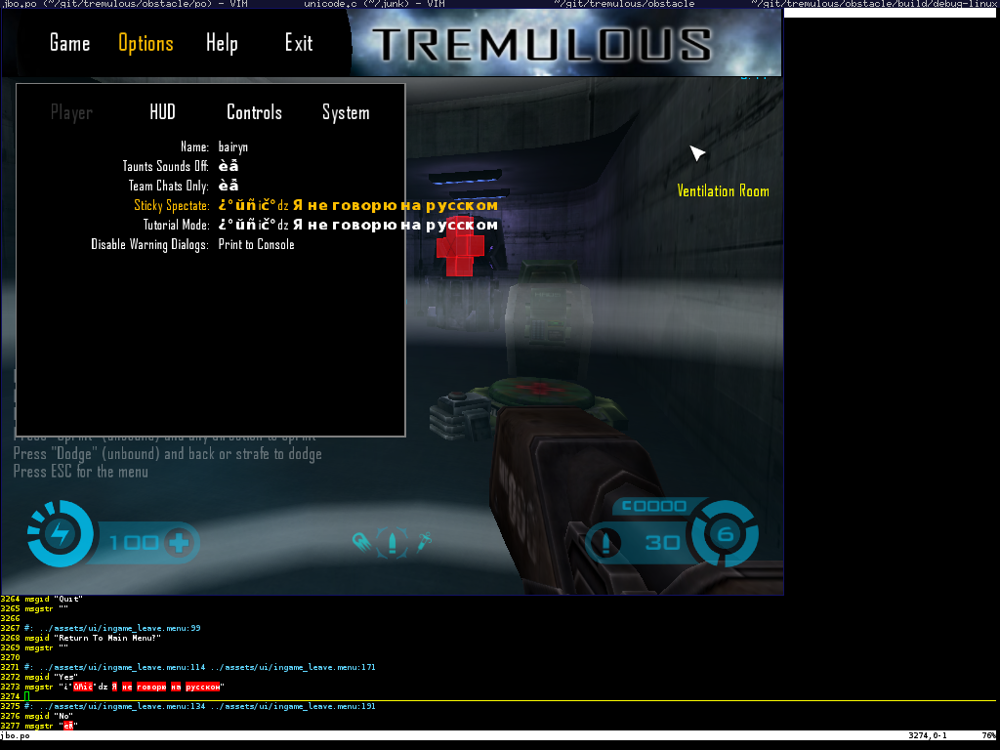
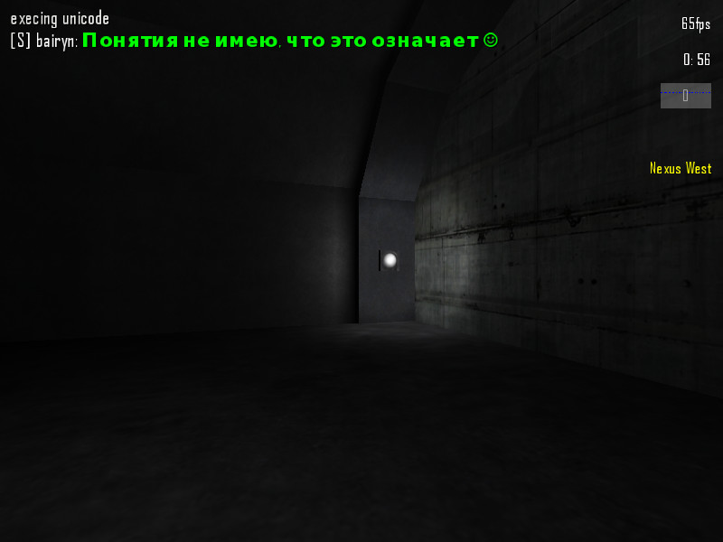
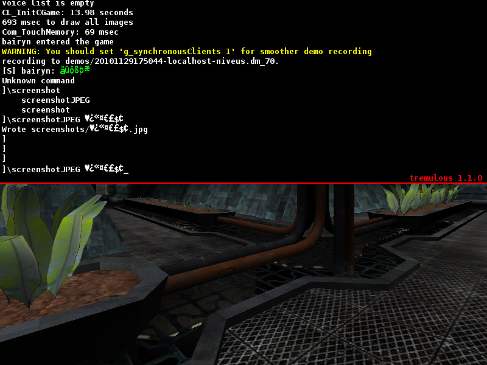
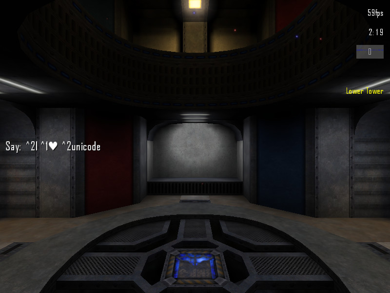
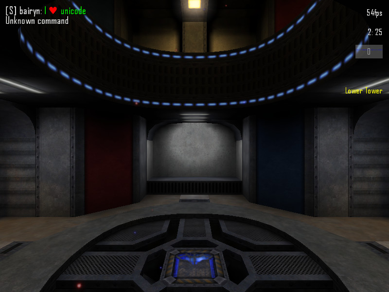
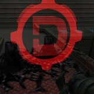

## Dark Engine
Based in i18n patch, for Tremulous since 2008:

* OC mod:
  * http://tremulous.net/forum/index.php?topic=12579.0
  * http://clanzerorisk.nfshost.com/index.php/topic,1327.0.html 
  * superpie's demo (thanks!): https://www.youtube.com/watch?v=IJHHYkd7OKo

* Domination mod:
  * http://tremulous.net/forum/index.php?topic=14058.0

* i18n (unicode and translation support):
  * http://tremulous.net/forum/index.php?topic=14699.0
  * [screenshots](docs/screenshots/i18n/screenshots.md)

## Features:
	* MP3 Support (in Progress)
	* OGG Video Support (in Progress)
	* XviD Video Support (Probably, in plans)
  
## i18n screenshots

## Domination screenshots

## OC screenshots

Screenshots from [superpie's demo](https://www.youtube.com/watch?v=IJHHYkd7OKo).

